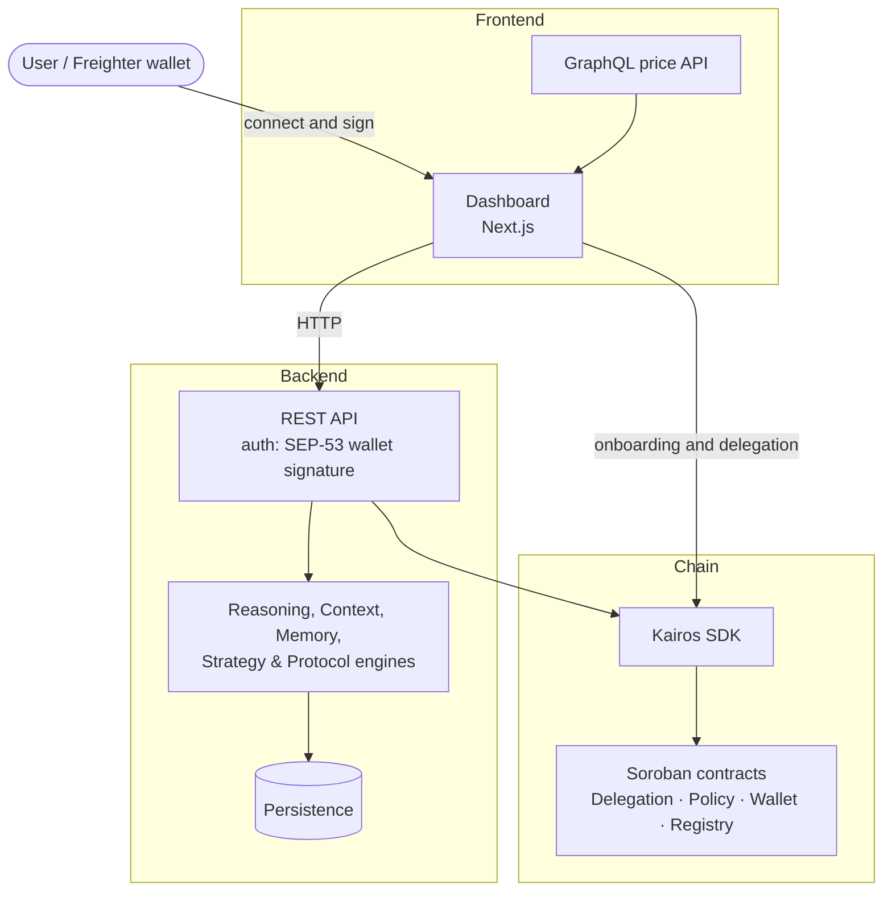
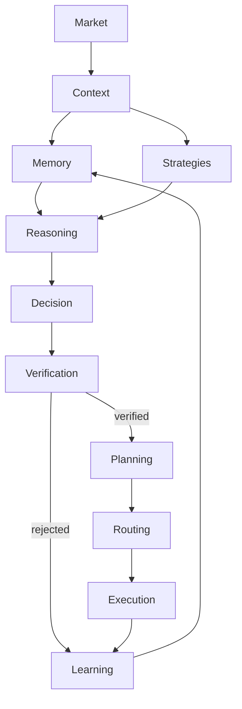

# Kairos

**Intent-based, non-custodial capital delegation on Stellar Soroban — AI proposes, the chain disposes.**

Kairos lets you delegate *what* an automated agent may do with your capital — without ever handing over your keys. You deploy a personal Smart Wallet, grant scoped and revocable delegations, and an AI reasoning engine proposes trades that are enforced by on-chain policies. Agents can advise; only the chain can move funds.

> [!NOTE]
> Kairos is live on Stellar **testnet**. Paper trading runs the full decision, verification, and audit pipeline end to end. Live on-chain execution is under development.

---

## Table of contents

- [Mission](#mission)
- [Why Kairos](#why-kairos)
- [Core Concepts](#core-concepts)
- [Key Features](#key-features)
- [Architecture Overview](#architecture-overview)
- [AI Decision Pipeline](#ai-decision-pipeline)
- [Smart Wallet](#smart-wallet)
- [SDK](#sdk)
- [Quick Start](#quick-start)
- [Technology Stack](#technology-stack)
- [Repository Structure](#repository-structure)
- [Documentation](#documentation)
- [Roadmap](#roadmap)
- [Contributing](#contributing)
- [License](#license)

---

## Mission

Kairos exists to remove the false trade-off at the heart of DeFi automation: either click every rebalance yourself, or deposit into a custodial bot and hope its risk controls hold.

The problem is that **trust lives in the wrong place** — the bot holds your keys or your funds, and its internal risk logic is opaque. Kairos moves the trust boundary onto the chain itself. You keep custody; the policy is the boundary, not the trust. Autonomous capital management matters because the strategies that protect and grow capital (rebalancing, yield rotation, volatility-aware sizing) are frequent and mechanical — yet each one is currently a custody decision. Kairos makes delegation a configuration problem, not a key-sharing problem.

## Why Kairos

- **You keep custody.** Funds live in *your* Smart Wallet (Soroban account abstraction). Agents never hold your keys.
- **Delegations are scoped and revocable.** A delegation names a specific agent and a set of policies. Revoke it on-chain at any time.
- **The chain is the final authority.** Even if every off-chain component were compromised, the policy contract still checks spend limits, asset whitelists, and time windows before a token moves.
- **AI is advisory only.** A deterministic reasoning engine proposes actions; policy gates and on-chain caveats decide what — if anything — executes. The model never sizes or authorizes a transfer.

## Core Concepts

- **Delegation** — a signed, on-chain grant of authority from a wallet owner to an agent, scoped by policies.
- **Caveats / Policies** — enforceable constraints (spend limits, asset whitelists, time windows) checked at redemption.
- **Smart Wallet** — a per-owner Soroban account-abstraction contract that holds funds and verifies delegated authority.
- **Advisory AI** — a reasoning engine that turns market context and memory into proposals, never into signed transactions.

## Key Features

| Feature | Description |
| :--- | :--- |
| **Smart Wallet** | Per-owner Soroban Smart Wallet deployed and recovered via sponsored Freighter onboarding. Non-custodial. |
| **Delegation & Policies** | Scoped, revocable, on-chain delegations with composable caveats (spend-limit, time-restriction, target-whitelist). |
| **AI Decision Pipeline** | Deterministic pipeline from market context to a verified, plan-ready decision — only one stage calls an LLM. |
| **Strategy Engine** | A registry of deterministic strategies (DCA, trend/mean-reversion, momentum, breakout, allocation). |
| **Memory Engine** | Episodic, semantic, and working memory with relevance retrieval and experience intelligence. |
| **Learning Engine** | Cohort-based learning analytics over trade outcomes (win rate, PnL, confidence, memory influence). |
| **Protocol Layer** | Pluggable protocol adapters (Blend, Soroswap) with deterministic routing and quote validation. |
| **Autonomous Runtime** | Orchestrates the full decision pipeline on a schedule, running against a deterministic paper execution environment. |
| **Benchmark Framework** | Reproducible, versioned harness that scores providers and models across scenarios with regression tracking. |
| **Dashboard** | Next.js console for portfolio, agents, delegations, and a live Context Layer inspector. |
| **SDK** | Typed TypeScript client over the deployed Soroban contracts. |
| **Developer Mode** | Hidden, allowlist-gated introspection surface for runtime, pipeline, and audit inspection. |

## Architecture Overview



The backend is the authoritative decision and execution terminal. The dashboard talks to it over HTTP and to the SDK directly for onboarding and delegations. The SDK is the only component that touches the chain.

## AI Decision Pipeline

Every decision an agent considers flows through one mostly-deterministic pipeline. Only the **Decision** stage calls an LLM; every other stage is rule-based and reproducible.



| Stage | What it does |
| :--- | :--- |
| **Market** | Live price, oracle health, trend, volatility, and regime. |
| **Context** | An immutable snapshot of everything the agent is authorized to know right now. |
| **Memory** | Relevant past experience — episodes, facts, and derived patterns. |
| **Strategies** | Deterministic signals from the strategy registry. |
| **Reasoning** | Combines context, memory, and policy into a structured prompt. |
| **Decision** | The LLM proposes a primary action with alternatives, evidence, and confidence. |
| **Verification** | A deterministic gate: policy, capital, risk, evidence, and consistency checks. |
| **Planning** | Builds a hashable, replayable execution plan with rollback steps. |
| **Routing** | Selects the best protocol for the action via deterministic ranking. |
| **Execution** | Runs the plan with retry, rollback, and audit journaling. |
| **Learning** | Records the outcome and feeds memory for future decisions. |

A decision rejected by Verification is never planned or executed. Live execution additionally requires on-chain caveat approval. Full design lives in [AI_PIPELINE.md](./AI_PIPELINE.md).

## Smart Wallet

Your funds live in a Smart Wallet — a Soroban account-abstraction contract that you own. Kairos never takes custody: you deploy the wallet (sponsored, so you only sign), and agents interact with it only through delegations you grant and can revoke.

Each delegation carries **caveats** — spend limits, asset whitelists, and time windows — that the policy contract enforces at redemption. This is the core safety model: the chain, not the agent, decides what actually executes. See [SMART_WALLET.md](./SMART_WALLET.md).

## SDK

The [`@wolf1276/kairos-sdk`](./SDK.md) is the typed TypeScript client over the deployed Soroban contracts and the only component that talks to the chain. It covers wallet deployment, off-chain delegation signing, policy (caveat) encoding, execution redemption, event decoding, and on-chain wallet registry lookup. Full reference in [SDK.md](./SDK.md).

## Quick Start

### Prerequisites

- Node.js `>=18` and [pnpm](https://pnpm.io/)
- A [Freighter](https://www.freighter.app/) wallet

### Install & run

```bash
git clone https://github.com/wolf1276/kairos.git
cd kairos
pnpm install
pnpm --filter @wolf1276/kairos-sdk build
pnpm --filter @wolf1276/kairos-agent-backend dev   # backend (paper mode)
pnpm --filter app dev                              # dashboard at http://localhost:3000
```

### Configure

Copy `.env.example` and set the Stellar network, the deployed contract IDs (from `configs/contracts.testnet.json`), and `AUTH_JWT_SECRET` (used after the SEP-53 challenge/verify handshake). Reasoning-provider configuration is documented in [AI_PIPELINE.md](./AI_PIPELINE.md) and [DEVELOPER_GUIDE.md](./DEVELOPER_GUIDE.md).

### Test & benchmark

```bash
pnpm --filter @wolf1276/kairos-sdk test                 # SDK unit tests
pnpm --filter @wolf1276/kairos-agent-backend test       # backend + reasoning tests
pnpm --filter @wolf1276/kairos-agent-backend benchmark   # reasoning benchmark
cd contracts/soroban && cargo test                      # contract tests
```

## Technology Stack

| Layer | Technology |
| :--- | :--- |
| Frontend | Next.js, React, TypeScript, Tailwind CSS, graphql-yoga, lightweight-charts. |
| Backend | Node.js, TypeScript, Express, SQLite (better-sqlite3) + Postgres (smart-wallet ownership), Vitest. |
| Blockchain | Stellar Soroban (Rust), `@stellar/stellar-sdk`, `@wolf1276/kairos-sdk`. |
| AI | Configuration-driven LLM providers with structured-output enforcement and deterministic fallbacks. |
| Deployment | Docker, Vercel, GitHub Actions CI. |

## Repository Structure

```
apps/        Dashboard and waitlist frontends
backend/     Agent backend: reasoning, context, memory, strategy, and protocol engines + REST API
packages/    SDK, shared types (agent signer lives here as an internal package)
contracts/   Soroban smart contracts (delegation, policy, wallet, registry)
configs/     Deployed contract IDs
scripts/     Deployment and end-to-end demo scripts
docs/        Architecture, API, and security documentation
```

### Deploy the backend to Render

`render.yaml` at repo root is a Render Blueprint for `backend/` (Docker-built, health-checked at `/health`, with a persistent Disk mounted at `AGENTS_DB_PATH` for the SQLite DB — agents/trades/etc). Smart wallet ownership (`smart_wallets`) no longer lives in that SQLite file — it's a managed Postgres instance (`kairos-smart-wallets` in `render.yaml`, wired to the web service via `DATABASE_URL`), so it survives redeploys/restarts even on plans without a persistent Disk. In the Render dashboard: **New +** → **Blueprint** → point at this repo. Fields marked `sync: false` in `render.yaml` must be filled in manually in the dashboard (they're secrets/deploy-specific values, not committed to git) — notably `ALLOWED_ORIGIN` (the deployed frontend's exact origin) and the contract IDs from `configs/contracts.testnet.json`.

The web service's SQLite DB (agents/trades/everything except smart wallets) still needs at least Render's Starter (paid) plan for the Disk to persist — the free tier wipes it on every redeploy/restart. `DATABASE_URL` (smart-wallet Postgres) persists regardless of the web service's plan.

### Deploy to Vercel

This is a pnpm monorepo with the Next.js app in `apps/web/`. Import the repo, set **Root Directory** to `apps/web/`, add the environment variables above, and deploy — the root `vercel.json` wires up the SDK build.

> [!IMPORTANT]
> Set `NEXT_PUBLIC_AGENTS_BACKEND_URL` to the Render backend's public URL (from the step above) in **Project Settings → Environment Variables**, scoped to every environment you deploy (Production, and Preview if preview deployments should also reach a live backend). It's a `NEXT_PUBLIC_` var, which Next.js inlines into the client bundle at *build* time — Vercel does expose Project env vars to the build step automatically, but only if they're added before the build runs and the deployment target (Production/Preview) matches. Leaving it unset doesn't fail the build; it silently ships a bundle where every browser tries to reach `localhost:4001` for wallet login and Smart Wallet lookup/creation — which fails in every visitor's browser with no useful error, while working fine in local dev (where that fallback happens to be correct).

---

## Deployed contracts (testnet)

| Contract | Address |
| :--- | :--- |
| DelegationManager | `CBR4HWJF4ZLDF4C6GF25PQWWZE5M7AOWGZHLJQH6DTEUXJ756KMOHYLF` |
| PolicyEngine | `CA6BPEFDZIC737VS26DQU77UYX5K4NB7VAKWNZAUO36WG7T24Z7N4BYD` |
| CustomAccount | `CAN25TOZQ6UXNVQO35RJLVND4VKTL52QOIQ7B4CWZRSZC5BDC5EQFNXF` |
| Registry | `CBDFFK2F4NZGXR7SRQAND3UZEIS32EHHVYNX4S475A7YYZDGN2E67SJV` |

Source of truth: [`configs/contracts.testnet.json`](./configs/contracts.testnet.json).

---

## Documentation

| Document | Contents |
| :--- | :--- |
| [ARCHITECTURE.md](./docs/architecture/ARCHITECTURE.md) | Soroban-native delegation framework design. |
| [BACKEND.md](./BACKEND.md) | Backend engines, REST API, and auth. |
| [FRONTEND.md](./FRONTEND.md) | Dashboard, onboarding, and price API. |
| [AI_PIPELINE.md](./AI_PIPELINE.md) | Reasoning pipeline design. |
| [SMART_WALLET.md](./SMART_WALLET.md) | Smart Wallet and onboarding. |
| [SDK.md](./SDK.md) | `@wolf1276/kairos-sdk` reference. |
| [PROTOCOLS.md](./PROTOCOLS.md) | Protocol adapters and routing. |
| [BENCHMARK.md](./BENCHMARK.md) | Benchmark framework. |
| [API_REFERENCE.md](./API_REFERENCE.md) | REST and GraphQL API surface. |
| [DEPLOYMENT.md](./DEPLOYMENT.md) | Docker, Vercel, and testnet deployment. |
| [DEVELOPER_GUIDE.md](./DEVELOPER_GUIDE.md) | Local development and Developer Mode. |
| [SECURITY.md](./SECURITY.md) | Security and threat model. |

### Component READMEs

Every workspace unit and major subsystem has its own README:

- Apps: [`apps/web`](./apps/web/README.md) (incl. [`oracle`](./apps/web/oracle/README.md))
- Backend: [`backend`](./backend/README.md) — subsystems [`reasoning`](./backend/src/reasoning/README.md), [`agentContext`](./backend/src/agentContext/README.md), [`memoryLayer`](./backend/src/memoryLayer/README.md), [`strategyEngine`](./backend/src/strategyEngine/README.md), [`protocolAdapters`](./backend/src/protocolAdapters/README.md), [`runtime`](./backend/src/runtime/README.md); benchmarks [`reasoning`](./backend/benchmarks/reasoning/README.md) · [`e2e`](./backend/benchmarks/e2e/README.md)
- Packages: [`sdk`](./packages/sdk/README.md) ([`examples`](./packages/sdk/examples/README.md)) · [`mcp-agent`](./packages/mcp-agent/README.md) · [`turnkey-signer`](./packages/turnkey-signer/README.md) · [`types`](./packages/types/README.md)
- Contracts: [`contracts/soroban`](./contracts/soroban/README.md) — [`delegation-manager`](./contracts/soroban/contracts/delegation-manager/README.md) · [`custom-account`](./contracts/soroban/contracts/custom-account/README.md) · [`policies`](./contracts/soroban/contracts/policies/README.md) · [`registry`](./contracts/soroban/contracts/registry/README.md)
- Support: [`configs`](./configs/README.md) · [`scripts`](./scripts/README.md) · [`docs`](./docs/README.md)

## Roadmap

### Completed

- Soroban contracts (delegation, policy, wallet, registry) — tested and deployed to testnet.
- SDK with on-chain-valid delegations, wallet/delegation/policy/execution/events/registry modules.
- Context, Memory, Strategy, and Reasoning engines; Provider and Protocol layers.
- Benchmark framework, paper-trading terminal, and Next.js dashboard.
- Freighter onboarding, SEP-53 wallet-signature session auth, and Developer Mode.

### In Progress

- Live on-chain agent execution (paper trading is fully functional today).
- Persistent memory storage providers.
- Mainnet deployment and contract hardening.

### Planned

- Multi-agent orchestration and richer analytics.
- Backtesting suite over historical market data.
- Observability exporters for runtime and context metrics.

## Contributing

Contributions are welcome. This is a pnpm monorepo; each layer has its own package and README.

1. Install prerequisites (Node >=18, pnpm).
2. `pnpm install` from the repo root.
3. Make changes with tests that fail before and pass after. No security check may be weakened to pass a test.
4. Run the relevant test suites and keep CI green.
5. Update documentation when behavior changes.

## License

Licensed under [MIT](./LICENSE).
