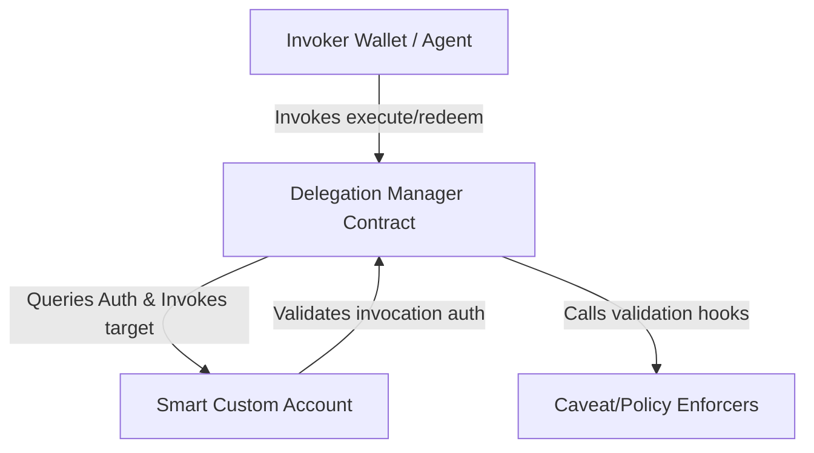

# Soroban-Native Delegation Framework Architecture

This document describes the design of the Soroban-Native Delegation Framework, inspired by MetaMask's Delegation Framework but built from the ground up for Stellar's Soroban smart contract platform.

## Design Patterns & Soroban Mapping

Unlike Ethereum, Soroban has native support for account abstraction and custom verification. Therefore, our architecture shifts away from EVM-centric standards (such as ERC-4337 and ERC-1271) and leverages native traits and host-managed execution context.

### 1. Smart Custom Account (SCA)
*   **Protocol Integration**: Implements custom verification via the native `__check_auth` callback.
*   **Delegated Authority Verification**: When the SCA is called via the `DelegationManager`, it checks if the transaction is authorized by calling back to the `DelegationManager` (which validates the signature chain, expiration, and active policies).

### 2. Delegation Manager
*   **Central Gateway**: Validates leaf-to-root delegation chains, manages delegation state (including active/revoked mappings), executes enforcer hooks, and performs the execution target invocations.
*   **Storage Rent Optimization**: Utilizes `Temporary` and `Instance` storage wherever possible for transit variables and revocations, and `Persistent` storage for stable configuration.
*   **Signature Verification**: Uses native host functions `env.crypto().verify_sig_ed25519` and `env.crypto().verify_sig_secp256r1` to execute high-performance signature checks for off-chain delegations.

### 3. Composable Policy Engine (Caveat Enforcers)
*   Policies are deployed as standalone contracts implementing a standardized trait:
    *   `before_all`
    *   `before_hook`
    *   `after_hook`
    *   `after_all`
*   **Native Policies Included**:
    *   **Spend Limits**: Tracks token-specific spend limits (utilizing Stellar Asset Contract - SAC).
    *   **Time Restrictions**: Checks ledger timestamps (`env.ledger().timestamp()`).
    *   **Method/Contract Whitelists**: Restricts allowed execution targets and function symbols.
    *   **Usage / Cooldown Limits**: Employs storage-backed counters.

---

## Storage Layout & Schema

### 1. Delegation Manager Storage
*   `Revoked(BytesN<32>) -> bool` (Persistent): Stores if a delegation hash has been revoked.
*   `Nonces(Address) -> u64` (Persistent): Tracks the current execution nonce for a delegator to prevent replay attacks.

### 2. Policy Storage (Enforcers)
*   `PolicyState(BytesN<32>, Key) -> Value` (Temporary): Stores policy execution state, such as period spending accumulator or execution counts. Scoped per delegation hash to prevent cross-delegation contamination.
