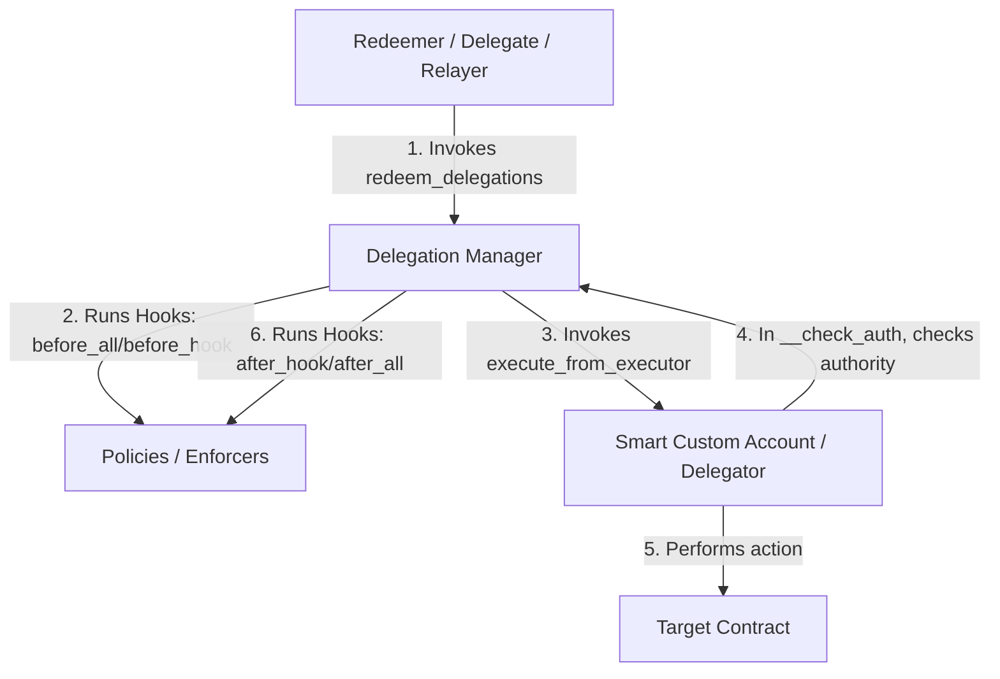

# Soroban-Native Delegation Framework Architecture Audit Report

This report presents a comprehensive architectural analysis and security audit of the Soroban-Native Delegation Framework implemented in `soroban-delegation`. The framework is inspired by MetaMask's delegation specification but tailored specifically for Stellar's Soroban smart contract platform, leveraging native account abstraction features.

---

## 1. Folder Structure

The repository is structured as a standard Rust Cargo workspace containing a set of smart contracts and configuration metadata:

```
soroban-delegation/
├── Cargo.toml                      # Workspace configuration defining members and shared dependencies
├── Cargo.lock                      # Locked dependency versions
├── ARCHITECTURE.md                 # Design patterns and storage mapping documentation
├── AUDIT.md                        # Security audit records and historical vulnerabilities
├── IMPLEMENTATION_PROGRESS.md       # Implementation tracking matrix
├── TASKS.md                        # Task checklist for development
├── SECURITY.md                     # Security policies and disclosure details
├── CHANGELOG.md                    # Log of releases and modifications
└── contracts/                      # Sub-workspace containing Soroban contracts
    ├── custom-account/             # Smart Custom Account (SCA) contract
    │   ├── Cargo.toml
    │   └── src/
    │       ├── lib.rs              # SCA logic and __check_auth verification hooks
    │       └── test.rs             # Unit tests for custom account execution
    ├── delegation-manager/         # Central Delegation Manager contract
    │   ├── Cargo.toml
    │   └── src/
    │       ├── lib.rs              # Signature/chain validation, hooks, and execution pipeline
    │       └── test.rs             # Unit and pipeline tests for delegation redemption
    └── policies/                   # Standalone Policy/Caveat Enforcers contract
        ├── Cargo.toml
        └── src/
            └── lib.rs              # Whitelists, spend limit tracking, and time boundaries
```

---

## 2. Smart Contract Architecture

The framework decouples account storage, execution control, and permission validation into three core modules:



### Module Responsibilities & Relationships
- **Smart Custom Account (SCA)**: Serves as the user's primary wallet. It holds the user's assets and has standard contract execution functions. It delegates execution authority to the `DelegationManager`.
- **Delegation Manager**: Acts as the central pipeline. It verifies cryptographic signature chains (delegation paths) and executes pre- and post-validation hooks on Policy contracts.
- **Policies / Enforcers**: Standalone enforcement rules (Caveat Enforcers) that validate transactional parameters dynamically against terms encoded in the delegation object.

---

## 3. Delegation Manager Contract

- **Purpose**: Central routing gateway and validation engine for delegating execution rights.
- **Responsibilities**:
  - Validates leaf-to-root delegation signature chains.
  - Prevents replay attacks using native nonces.
  - Tracks revoked/disabled delegations.
  - Sequentially invokes policy validation hooks (`before_all`, `before_hook`, `after_hook`, `after_all`).
  - Calls `execute_from_executor` on the root delegator (SCA) to perform target interactions.
- **Dependencies**: `soroban-sdk` (v22), cryptographic host functions (`env.crypto()`), and XDR serialization.

---

## 4. Custom Account Contract

- **Purpose**: A smart wallet that enables custom authentication and transaction execution.
- **Responsibilities**:
  - Implements the custom verification hook (`__check_auth`) required by Soroban's native auth framework.
  - Handles direct executions from the owner.
  - Restricts execution authority to the authorized `DelegationManager`.
  - Performs signature verification fallback for off-chain protocols (analogous to ERC-1271).
- **Dependencies**: `soroban-sdk` (v22) and host cryptography.

---

## 5. Policy Contracts

- **Purpose**: Encapsulates runtime boundaries (limits, restrictions, and permissions) for delegations.
- **Responsibilities**:
  - Parses terms encoded in caveats.
  - **Target Whitelisting (Policy ID 1)**: Asserts that `context.target` matches the whitelisted contract address.
  - **Spend Limit (Policy ID 2)**: Tracks cumulative asset spending (amount + asset address) inside a configurable time window (e.g. daily limits) utilizing temporary storage.
  - **Time Limit (Policy ID 3)**: Rejects execution if current ledger timestamp is outside of the `[start_time, end_time]` window.
- **Dependencies**: `soroban-sdk` (v22), XDR deserialization (`Address::from_xdr`).

---

## 6. Storage Layout

The framework utilizes Soroban's state management model optimized for resource rents and lifecycle management:

| Contract | Key Name | Storage Type | TTL / Rent Management | Purpose |
| :--- | :--- | :--- | :--- | :--- |
| **Custom Account** | `DataKey::Owner` | `Instance` | Extended on initialization (10k-100k thresholds) | Identifies the EOA owner of the SCA |
| **Custom Account** | `DataKey::DelegationManager` | `Instance` | Extended on initialization (10k-100k thresholds) | The authorized central executor contract |
| **Delegation Manager** | `DataKey::Paused` | `Instance` | Checked on execution | Global safety switch |
| **Delegation Manager** | `DataKey::Owner` | `Instance` | Checked on pause/unpause | Identifies delegation manager administrator |
| **Delegation Manager** | `DataKey::Nonce(Address)` | `Persistent` | Extended on reading/writing | Replay protection tracking per delegator |
| **Delegation Manager** | `DataKey::Disabled(BytesN<32>)` | `Persistent` | Extended on state updates | Records revoked delegation hashes |
| **Policies (Enforcers)** | `PolicyStateKey::Spent(BytesN<32>)` | `Temporary` | Extended dynamically during hook checks | Tracks accumulated spend amount for a delegation hash |
| **Policies (Enforcers)** | `PolicyStateKey::LastSpentTime(BytesN<32>)`| `Temporary` | Extended dynamically during hook checks | Records timestamp of the last spent tracking update |

---

## 7. Data Structures

The core structs used to serialize, hash, and evaluate delegation executions:

### 1. `Caveat`
Represents an individual policy rule.
```rust
pub struct Caveat {
    pub enforcer: Address,  // Policy contract address
    pub terms: Bytes,       // Bytearray encoding policy arguments (e.g. whitelist address, limit amount)
}
```

### 2. `Delegation`
Represents a cryptographic delegation from a delegator to a delegate.
```rust
pub struct Delegation {
    pub delegate: Address,     // Address authorized to execute actions
    pub delegator: Address,    // Address granting authority
    pub authority: BytesN<32>, // Parent delegation hash (or ROOT_AUTHORITY array [0xff; 32])
    pub caveats: Vec<Caveat>,  // Conditions under which this delegation is valid
    pub salt: u64,             // Entropy factor
    pub nonce: u64,            // Replay protection sequence number
    pub signature: BytesN<64>, // Ed25519 signature of delegation hash signed by delegator
}
```

### 3. `Execution`
Defines the final target contract call payload.
```rust
pub struct Execution {
    pub target: Address,   // Contract to invoke
    pub function: Symbol,  // Function symbol to call
    pub args: Vec<Val>,    // Function arguments
}
```

### 4. `ExecutionContext`
Context details passed dynamically to enforcers during execution hook processing.
```rust
pub struct ExecutionContext {
    pub target: Address,
    pub function: Symbol,
    pub args: Vec<Val>,
    pub redeemer: Address,
    pub delegate: Address,
    pub delegator: Address,
    pub ledger_sequence: u32,
    pub timestamp: u64,
}
```

---

## 8. Events

Events published by the framework to maintain off-chain indexers and user transparency:

- **Delegation Disabled**:
  - Topic: `(symbol_short!("disabled"), delegator_address)`
  - Data: `delegation_hash: BytesN<32>`
- **Delegation Enabled / Re-enabled**:
  - Topic: `(symbol_short!("enabled"), delegator_address)`
  - Data: `delegation_hash: BytesN<32>`
- **Delegation Executed / Redeemed**:
  - Topic: `(symbol_short!("redeemed"), redeemer_address)`
  - Data: `root_delegator_address: Address`

---

## 9. Public Contract Methods

### `CustomAccount`
- `init(env: Env, owner: Address, delegation_manager: Address)`: Set owner and authorized manager (one-time).
- `execute(env: Env, target: Address, function: Symbol, args: Vec<Val>) -> Val`: Direct execution (requires owner auth).
- `execute_from_executor(env: Env, target: Address, function: Symbol, args: Vec<Val>) -> Val`: Authorized execution via manager (requires manager auth).
- `is_valid_signature(env: Env, hash: BytesN<32>, signature: BytesN<64>) -> bool`: Verifies signature against owner's key.
- `__check_auth(env: Env, signature: Val, auth_context: Vec<Context>, args: Vec<Val>)`: Soroban native auth callback.

### `DelegationManager`
- `init(env: Env, owner: Address)`: Configure contract owner.
- `pause(env: Env)` / `unpause(env: Env)`: Pause/resume all delegatable executions (requires owner auth).
- `is_paused(env: Env) -> bool`: Query pause state.
- `disable_delegation(env: Env, delegator: Address, delegation: Delegation)`: Revoke/disable a delegation hash (requires delegator auth).
- `enable_delegation(env: Env, delegator: Address, delegation: Delegation)`: Un-revoke a delegation hash (requires delegator auth).
- `is_delegation_disabled(env: Env, delegation_hash: BytesN<32>) -> bool`: Check revocation status.
- `get_nonce(env: Env, delegator: Address) -> u64`: Retrieve current nonce sequence.
- `get_delegation_hash(env: Env, delegation: Delegation) -> BytesN<32>`: Utility to compute SHA-256 hash of a delegation.
- `redeem_delegations(env: Env, redeemer: Address, permission_contexts: Vec<Vec<Delegation>>, executions: Vec<Execution>)`: Pipeline to validate delegation chains and execute actions.

---

## 10. SDK/Client Methods

For a frontend typescript client to interact with this framework, the SDK needs to implement:
- **`computeDelegationHash(delegation: Delegation): string`**: Reproduces SHA-256 binary hash matching the contract's `get_delegation_hash` logic.
- **`signDelegation(delegation: Delegation, signer: Signer): Promise<string>`**: signs the delegation hash using the delegator's private key.
- **`createDelegationChain(delegations: Delegation[]): DelegationChain`**: Forms leaf-to-root validation paths.
- **`redeem(redeemer: Signer, chain: DelegationChain[], executions: Execution[]): Promise<Transaction>`**: Packages parameters and submits `redeem_delegations` transactions.

---

## 11. Authentication Flow

Soroban uses native account abstraction:
1. **Direct Auth**: A user calls `CustomAccount.execute`. The transaction signature triggers `__check_auth`, verifying the signature belongs to the `Owner`.
2. **Delegated Auth**:
   - The delegate/relayer submits a transaction invoking `DelegationManager.redeem_delegations`.
   - The `DelegationManager` parses the delegation chain and executes cryptographic checks.
   - The target contract requires auth from `CustomAccount`. The host calls `CustomAccount.__check_auth`.
   - Since no owner signature is passed, the account verifies that the direct caller is the `DelegationManager`, which passes the auth check.

---

## 12. Delegation Lifecycle

1. **Creation**: The delegator specifies `delegate`, `caveats` (policies), `salt`, and queries the `DelegationManager` for their current `nonce`.
2. **Signing**: Delegator hashes this structure and signs it off-chain.
3. **Distribution**: The delegation object is sent off-chain to the delegate.
4. **Execution**: The delegate executes transactions within policy bounds.
5. **Revocation**: At any time, the delegator can call `disable_delegation` on-chain to blacklist the delegation hash.

---

## 13. Execution Lifecycle

Within `redeem_delegations`:
```
[Check Paused State]
        │
[Validate Leaf Delegate matches Redeemer]
        │
[Loop: Verify Delegation Signatures & Nonces]
        │
[Loop: Verify Authority Links (chain[i].authority == hash(chain[i+1]))]
        │
[Execute before_all Policy Hooks (leaf to root)]
        │
[Execute before_hook Policy Hooks (leaf to root)]
        │
[Invoke root_delegator.execute_from_executor()]
        │
[Execute after_hook Policy Hooks (root to leaf)]
        │
[Execute after_all Policy Hooks (root to leaf)]
        │
[Increment Nonces & Publish Events]
```

---

## 14. Permission Model

- Only the **SCA Owner** can directly call `execute`.
- Only the **Delegation Manager** can call `execute_from_executor` on the custom account.
- The **Redeemer** must be the exact `delegate` specified in the leaf delegation.
- Policies restrict targets, maximum spending, and valid execution windows.

---

## 15. Session Key Model

Off-chain agents/trading systems can be assigned an ephemeral Ed25519 public key.
- The user creates a `Delegation` designating this ephemeral key as the `delegate`.
- Caveats are appended (e.g. limiting trade size, restricting targets to DEX contracts, and defining a 24-hour expiration window).
- The agent uses this ephemeral session key to sign transactions, invoking `redeem_delegations` without requiring the user's primary wallet key.

---

## 16. Wallet Lifecycle

1. **Deployment**: Deploy `CustomAccount` and `DelegationManager`.
2. **Initialization**: Invoke `init` on the `CustomAccount`, mapping it to the user's EOA owner address and the deployed `DelegationManager` address.
3. **Funding**: Transfer Stellar/SAC tokens to the `CustomAccount` address.
4. **Authorized Upgrades**: If the delegation framework changes, the owner executes a code upgrade or updates the authorized `DelegationManager` address stored in instance storage.

---

## 17. How a Frontend Interacts with these Contracts

1. **Read Nonce**: Query `DelegationManager::get_nonce(delegator)`.
2. **Compose Delegation**: Build the `Delegation` struct with the delegate address, enforcer policy addresses, terms, and the current nonce.
3. **Request Signature**: Prompt the user to sign the hash of the delegation payload using their wallet (e.g., Freighter, Albedo).
4. **Broadcast Redemption**: Pass the signed delegation chain alongside execution instructions to the delegate agent, which formats and submits the `redeem_delegations` transaction.

---

## 18. What Information is Available for an AI Trading Agent

Using only the smart contract state and the market connector, an AI trading agent has access to:
- **Market Snapshot**: Current price, 24h volume, price change percentage, historical candle structures, and calculated technical indicators (EMA, SMA, RSI, MACD, ATR).
- **Delegation limits**: Active spend limits and time limits encoded in the delegation caveats.
- **Spent trackers**: Current temporary storage values reflecting how much of the spend limit quota has already been consumed (`PolicyStateKey::Spent`).
- **Account Nonce**: The current transaction nonce tracking the sequence of execution.

---

## 19. What Additional Information the AI Would Need

To trade safely in production, the AI agent requires auxiliary off-chain and context data not stored directly in these contracts:
1. **Network Gas / Fees**: Dynamic Soroban base fee rate estimates to optimize execution costs.
2. **Slippage & Orderbook Depth**: Real-time liquidity information to verify execution pathways.
3. **Tx Status Tracking**: Transaction submission state, execution confirmations, and mempool status.
4. **RPC Latency/Health**: Endpoint availability status for reliable submission.
