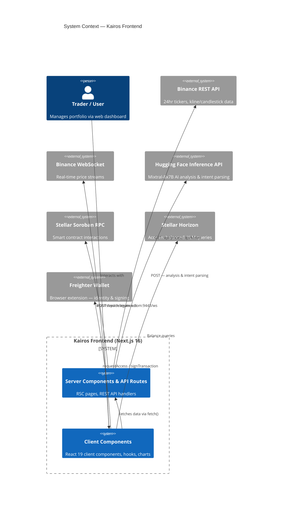
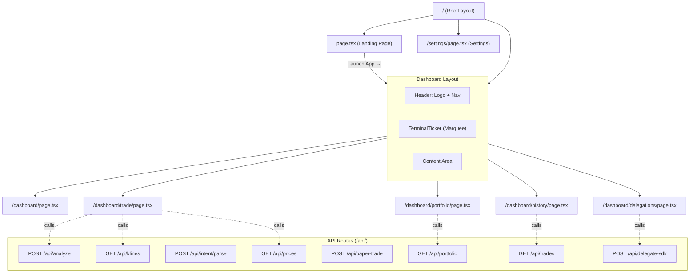
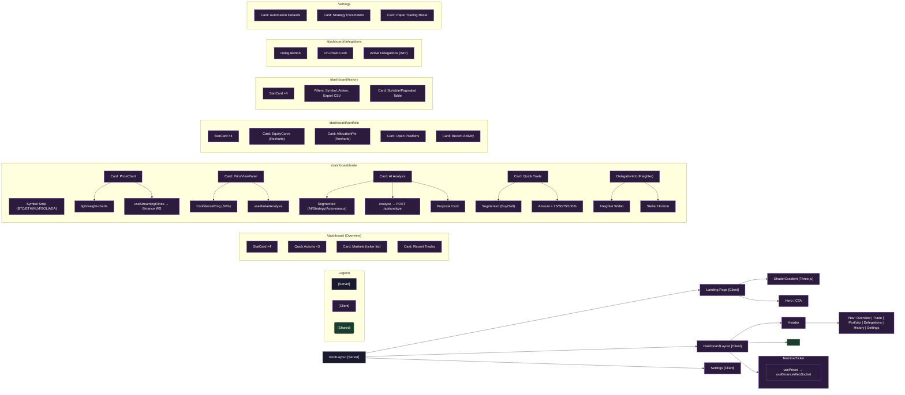
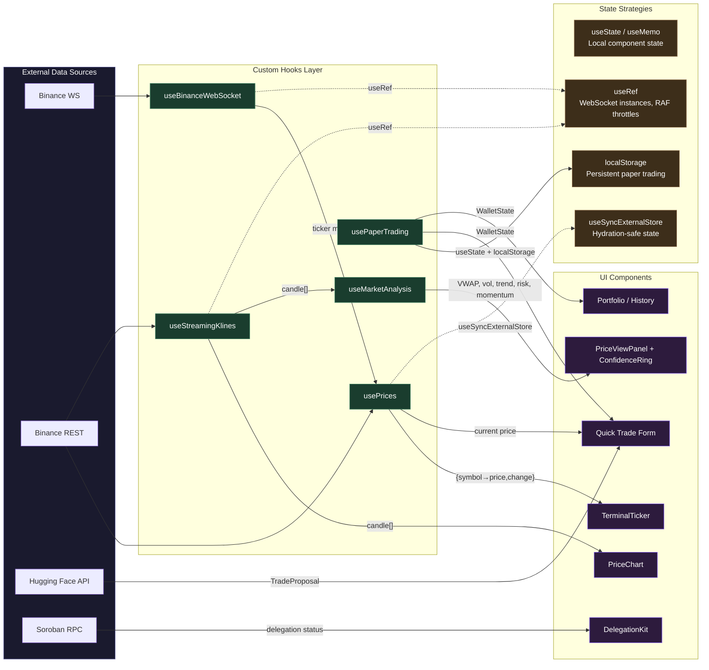

# Kairos Frontend Architecture

## 1. System Context

## 2. Route & Page Structure

## 3. Component Hierarchy

## 4. Data Flow

```mermaid
flowchart TD
  subgraph External["External Services"]
    BW["Binance WebSocket\nwss://stream.binance.com:9443"]
    BR["Binance REST\napi.binance.com"]
    HF["Hugging Face\nMixtral-8x7B"]
    SR["Stellar Soroban RPC"]
    SH["Stellar Horizon"]
    FW["Freighter Wallet\n(Browser Extension)"]
  end

  subgraph Server["Next.js Server (API Routes)"]
    PricesAPI["GET /api/prices"]
    KlinesAPI["GET /api/klines"]
    AnalyzeAPI["POST /api/analyze"]
    IntentAPI["POST /api/intent/parse"]
    DelegateAPI["POST /api/delegate-sdk"]
    PaperAPI["POST /api/paper-trade"]
    PortfolioAPI["GET /api/portfolio"]
    TradesAPI["GET /api/trades"]
  end

  subgraph Client["Client-Side"]
    subgraph Hooks["Custom Hooks"]
    uBW["useBinanceWebSocket"]
    uSK["useStreamingKlines"]
    uP["usePrices"]
    uMA["useMarketAnalysis"]
    uPT["usePaperTrading"]
    end

    subgraph State["State Layer"]
    LS_Prices["localStorage\nkairos_paper_*"]
    LS_Settings["localStorage\nkairos_settings"]
    WS_Ref["useRef\nWebSocket instances"]
    end

    subgraph Components["UI Components"]
    Ticker["TerminalTicker"]
    PriceChart["PriceChart"]
    PriceView["PriceViewPanel"]
    TradeForm["Quick Trade"]
    Delegation["DelegationKit"]
    Overview["Overview / Portfolio / History"]
    end
  end

  BR --> PricesAPI
  PricesAPI --> uP

  BR --> KlinesAPI
  KlinesAPI --> uSK

  BW --> uBW
  uBW --> uP
  uP --> Ticker
  uP --> TradeForm

  uSK --> PriceChart

  uSK --> uMA
  uMA --> PriceView

  HF -->|"POST"| AnalyzeAPI
  AnalyzeAPI -->|"Proposal"| TradeForm

  FW -->|"requestAccess"| Delegation
  Delegation -->|"signTransaction"| FW
  Delegation --> DelegateAPI
  DelegateAPI --> SR

  SH --> Delegation

  uPT --> LS_Prices
  uPT --> Overview
  uPT --> TradeForm

  subgraph DataTypes["Data Types"]
    TickerData["24hr Ticker\n{symbol, price, change}"]
    CandleData["Candlestick\n{open, high, low, close, volume}"]
    Analysis["TradeProposal\n{direction, confidence, entry, stop, takeProfit}"]
    WalletState["WalletState\n{balance, positions, trades}"]
  end

  uP -.-> TickerData
  uSK -.-> CandleData
  AnalyzeAPI -.-> Analysis
  uPT -.-> WalletState
```

## 5. State Management

## 6. External Service Integration Map

| Service | Protocol | Endpoint | Used By | Data |
|---------|----------|----------|---------|------|
| **Binance REST** | HTTPS | `api.binance.com/api/v3/ticker/24hr`, `/klines` | Server API routes | Price snapshots, OHLCV candles |
| **Binance WebSocket** | WSS | `stream.binance.com:9443/ws` | Client hooks (`useBinanceWebSocket`, `useStreamingKlines`) | Real-time 24hr ticker updates, live kline streams |
| **Hugging Face** | HTTPS | `api-inference.huggingface.co/models/mistralai/Mixtral-8x7B-Instruct-v0.1` | Server API routes (`/api/analyze`, `/api/intent/parse`) | Trade proposals, intent parse results |
| **Stellar Soroban RPC** | HTTPS | `soroban-testnet.stellar.org` | Server API routes (`/api/delegate-sdk`) | Smart wallet deployment, delegation creation/execution |
| **Stellar Horizon** | HTTPS | `horizon-testnet.stellar.org` | Client (`app/lib/stellar.ts`) | Account balance, XLM transactions |
| **Freighter Wallet** | Browser Extension API | `window.freighter` | Client (`DelegationKit`, `stellar.ts`) | Wallet address, transaction signatures |
